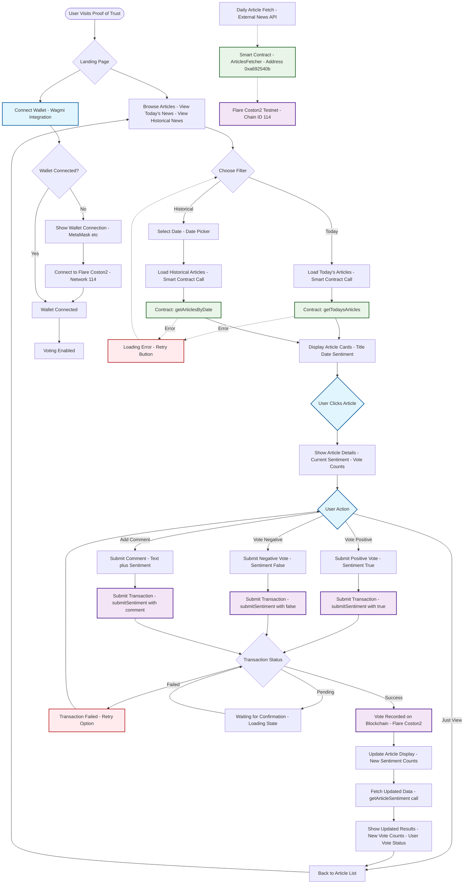

# Proof of Trust

A Web3 application for tracking news sentiment and building trust through blockchain verification on the Flare network.

## 🎯 Overview

Proof of Trust enables transparent, immutable news sentiment tracking by allowing users to vote on news articles and store their sentiment data on the Flare blockchain. The platform promotes community consensus and builds trust through verifiable, on-chain data.

## 🔄 Complete End-to-End Flow



## 🏗️ Architecture Components

### Frontend (Next.js + React)
- **Framework**: Next.js 15 with TypeScript
- **Styling**: Tailwind CSS
- **State Management**: TanStack Query + Wagmi
- **Web3 Integration**: Wagmi + Viem

### Blockchain Layer
- **Network**: Flare Coston2 Testnet (Chain ID: 114)
- **Smart Contract**: ArticlesFetcher (`0xa692540b8c89A8B4aFF92225B55C01dbD2085D7A`)
- **Wallet Connection**: MetaMask, WalletConnect, etc.

### Smart Contract Functions
```solidity
// Read Functions
getTodaysArticles() → ArticleData[]
getArticlesByDate(uint256 targetDate) → ArticleData[]
getArticleSentiment(uint256 articleId, address user) → ArticleSentimentView
getAvailableDates() → uint256[]

// Write Functions  
submitSentiment(uint256 articleId, bool sentiment, string comment)
```

## 🗃️ Data Structure

### ArticleData
```typescript
type ArticleData = {
  title: string;
  date: string;
  contentLength: bigint;
  publicationCount: bigint;
  overallBias: string;
  publishedTimestamp: bigint;
  id: bigint;
}
```

### ArticleSentimentView
```typescript
type ArticleSentimentView = {
  positiveCount: bigint;
  negativeCount: bigint;
  userHasVoted: boolean;
  userSentiment: boolean;
  userComment: string;
  votingActive: boolean;
}
```

## 🚀 Getting Started

1. **Clone the repository**
   ```bash
   git clone git@github.com:yashgo0018/proof-of-truth.git
   ```

2. **Install dependencies**
   ```bash
   bun install
   ```

3. **Start development server**
   ```bash
   cd packages/webapp
   bun run dev
   ```

4. **Configure MetaMask**
   - Network: Flare Coston2
   - Chain ID: 114
   - RPC URL: `https://coston2-api.flare.network/ext/bc/C/rpc`

## 🔧 Key Features

### 📰 Article Management
- Daily automated article fetching
- Historical article browsing
- Date-based filtering
- Real-time sentiment display

### 🗳️ Sentiment Voting
- Positive/Negative sentiment voting
- Comment submission with votes
- User vote tracking
- Prevents double voting

### 🔗 Blockchain Integration
- Immutable vote storage
- Transparent sentiment data
- Decentralized consensus
- Gas-efficient transactions

### 👤 User Experience
- No-wallet browsing mode
- Seamless wallet connection
- Real-time UI updates
- Error handling & retries

## 🛠️ Technical Stack

- **Frontend**: Next.js, React, TypeScript, Tailwind CSS
- **Web3**: Wagmi, Viem, TanStack Query
- **Blockchain**: Flare Network (Coston2 Testnet)
- **Smart Contracts**: Solidity
- **Package Manager**: Bun

## 🔒 Security Considerations

- User vote validation
- Preventing duplicate votes
- Secure wallet integration
- Transaction error handling
- Smart contract interaction safety

## 🌐 Network Configuration

### Flare Coston2 Testnet
- **Chain ID**: 114
- **Currency**: C2FLR (Testnet Flare)
- **RPC URL**: `https://coston2-api.flare.network/ext/bc/C/rpc`
- **Explorer**: `https://coston2-explorer.flare.network`

## 📝 Smart Contract Addresses

- **ArticlesFetcher**: `0xa692540b8c89A8B4aFF92225B55C01dbD2085D7A`

## 🤝 Contributing

1. Fork the repository
2. Create a feature branch
3. Make your changes
4. Submit a pull request

## 📄 License

This project is licensed under the MIT License.

---

**Proof of Trust** - Building trust through transparent, immutable news sentiment tracking powered by Web3 🚀
